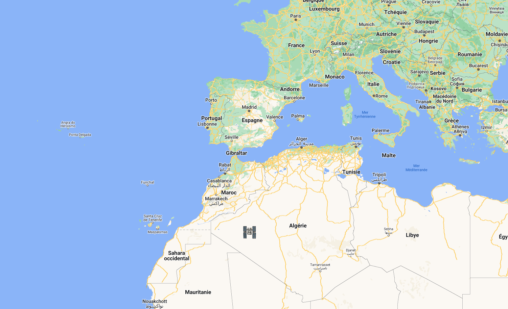
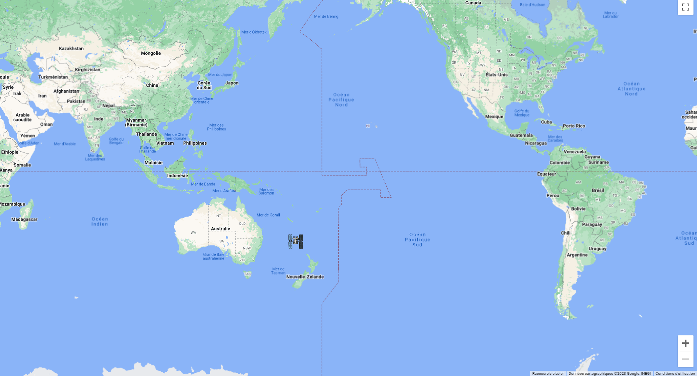
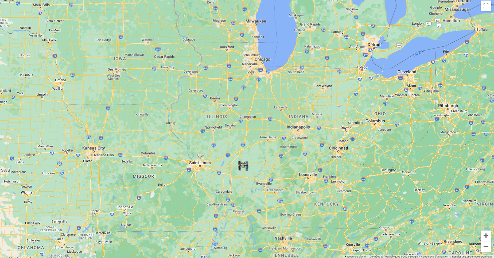
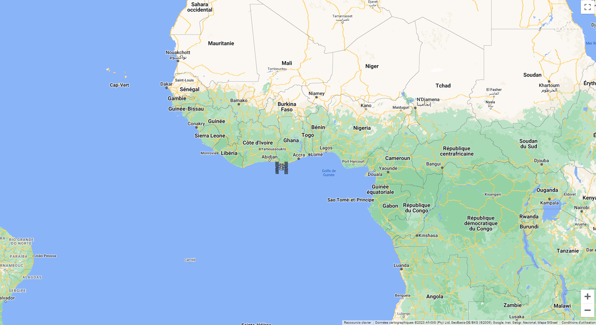
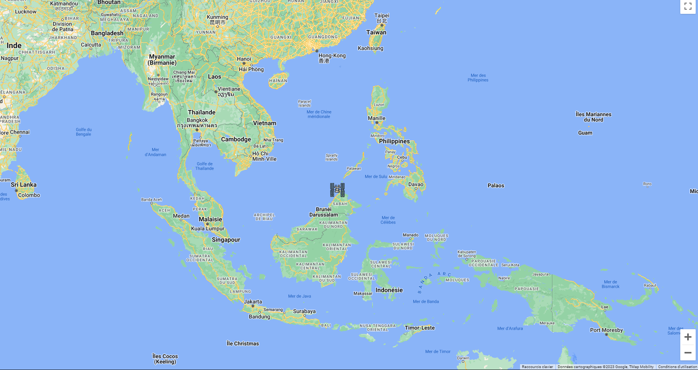

# ISS TRACKER

DISCLAIMER : GoogleMap API is no longer free so worldmap is not displayed as it used to be. 

### for result with paid API see screenshots below 

 

Find out where the International Space Station is located at the moment

[Learn more about the ISS](https://en.wikipedia.org/wiki/International_Space_Station)

--> [Direct link to the app](https://laurentarcosisstracker.surge.sh/) <--

 

